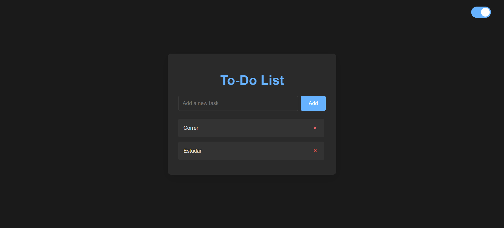

# ✅ To-Do List com LocalStorage

Uma aplicação simples, leve e responsiva de lista de tarefas, construída com foco em usabilidade, design minimalista e persistência de dados no navegador.

📸 Preview

🔗 **Acesse o projeto online:**  
👉 [https://to-do-list-six-mu-71.vercel.app](https://to-do-list-six-mu-71.vercel.app)

---

## ✨ Funcionalidades

- ✅ **Adicionar tarefas** com apenas um clique
- ❌ **Excluir tarefas** individualmente
- 💾 **Salvamento automático no LocalStorage**
- 🌗 **Modo escuro/claro** com alternância visual
- 📱 **Design responsivo e minimalista**, adaptado para desktop e mobile

---

## 🧪 Tecnologias utilizadas

- **HTML5** + **CSS3**
- **JavaScript (ES6+)**
- **LocalStorage API**
- **Responsividade com media queries**
- Sem dependências externas: projeto 100% vanilla

---

## 📦 Como rodar localmente

git clone https://github.com/seu-usuario/to-do-list.git

cd to-do-list

📄 Licença
Este projeto está licenciado sob a MIT License.
Desenvolvido por [Seu Nome ou GitHub]
